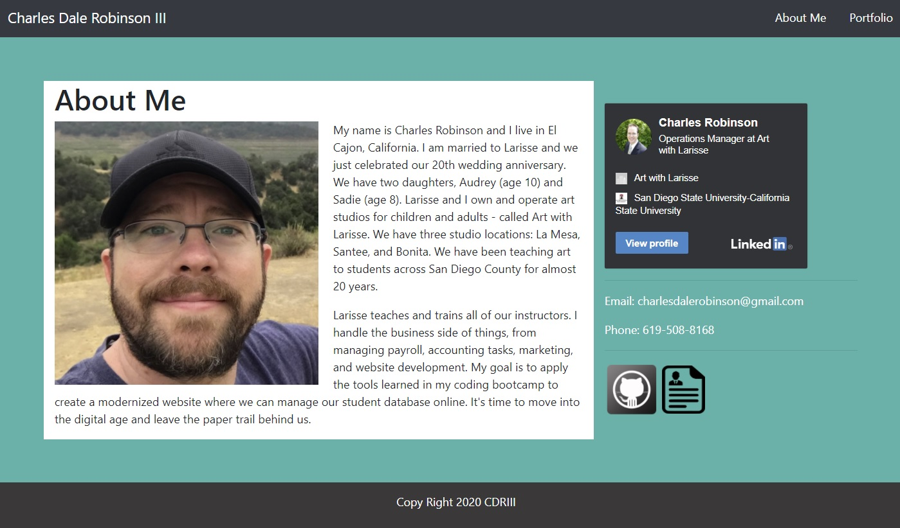

# responsive-portfolio-using-bootstrap

## Description
This project involved creating a mobile responsive portfolio website comprised of an about me page and a portfolio page.

This was accomplished by: 
    <ul>
        <li>Implementing a mobile responsive grid system using Bootstrap elements</li>
        <li>Using jQuery to manipulate the DOM to showcase project details as they are clicked on.</li>
    </ul>

## Technologies Used
<ul>
    <li>HTML</li>
    <li>CSS</li>
    <li>Bootstrap CSS Framework</li>
    <li>jQuery</li>
</ul>

## What I Learned

While working on this project I learned about applying bootstrap classes to create a mobile responsive portfolio website to showcase my coding bootcamp projects. 

## Link to my responsive portfolio:
https://cdrobinsoniii.github.io/responsive-portfolio-using-bootstrap/